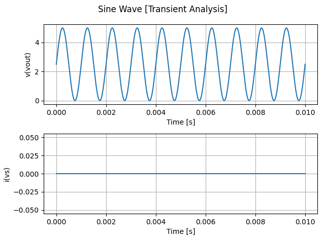

# Spice Mill

[](https://opensource.org/licenses/MIT)

I'm working on Spice Mill to aid me in circuit analysis. Spice Mill focuses primarily on post processing ASCII raw files generated Ngspice. This is intended for my personal use, but I'm releasing it for anyone who's interested. Keep in mind that everything here is subject to change.


## Generating Test Data with Ngspice

Here's a quick example on how to generate test data with Ngspice for use with Spice Mill. First you'll need to define a test circuit. For this example we'll use a sine signal:

$$v_s(t) = A \cdot sin(2\pi ft) + V_0$$

Where the amplitude $A = 2.5 V$, the offset $V_0 = 2.5 V$ and the frequency $f = 1 kHz$. For this example we'll run a transient analysis over the interval $0 \le t \le 10 ms$ with timesteps of $\Delta t = 10 \mu s$. We get the following netlist:

```
.title Sine Wave
vs vout 0 sin(2.5, 2.5, 1k)
.tran 10u 10m
.end
```

We save this to a file named `test.cir` and run the following command to generate the test data:

```
SPICE_ASCIIRAWFILE=1 ngspice -b -r test.raw test.cir
```

Ngspice should now write the simulation data to a file named `test.raw`.

## Plotting Simulation Results

To plot the simulation results provided by an ASCII .raw file, run the following command:

```
python spicemill.py --raw <raw_file>
```

If no filename was given with the `--raw` option, it defaults to `data.raw`.

